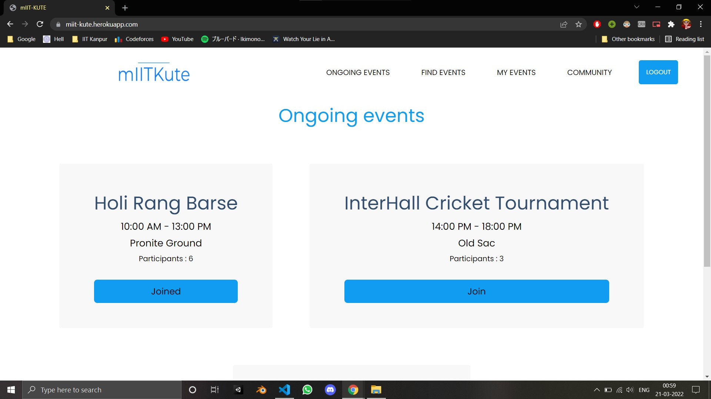

<div id="top"></div>

<br />
<div align="center">
  <a href="https://github.com/github_username/repo_name">
    
  </a>

<h3 align="center">mIIT-Kute</h3>

  <p align="center">
    A user friendly meet app for IITK Janta
    <br />
    <a href="https://miit-kute.herokuapp.com/"><strong>Explore the webapp »</strong></a>
    <br />
    <br />
    <a href="https://github.com/Deepak-Sangle/mIIT-Kute">View Demo</a>
    ·
    <a href="https://github.com/Deepak-Sangle/mIIT-Kute/issues">Report Bug</a>
    ·
    <a href="https://github.com/Deepak-Sangle/mIIT-Kute/issues">Request Feature</a>
  </p>
</div>


<!-- TABLE OF CONTENTS -->
<details>
  <summary>Table of Contents</summary>
  <ol>
    <li>
      <a href="#about-the-project">About The Project</a>
      <ul>
        <li><a href="#built-with">Built With</a></li>
      </ul>
    </li>
    <li>
      <a href="#getting-started">Getting Started</a>
      <ul>
        <li><a href="#prerequisites">Prerequisites</a></li>
        <li><a href="#installation">Installation</a></li>
      </ul>
    </li>
    <li><a href="#roadmap">Roadmap</a></li>
    <li><a href="#contributing">Contributing</a></li>
      </ol>
</details>


<!-- ABOUT THE PROJECT -->
## About The Project




mIIT-Kute is a social networking platform for campus janta of IITK where user can enjoy different events with their friends in IITK : 

### Built With

* [Node.js](https://nodejs.org/)
* [Passport.js](https://www.passportjs.org/)
* [Express.js](https://expressjs.com/)
* [EJS.js](https://ejs.co/)
* [Mongoose](https://mongoosejs.com/)


<!-- GETTING STARTED -->
## Getting Started

You can clone the repository using the github clone option or download the zip file directly. In order to run the webapp on local host, one can install all the dependencies and then simply run it on VS Code.

### Prerequisites

To install all the dependencies and packages of the web app simply run the following command on the cmd terminal
 npm
  ```sh
  npm install 
  ```

### Installation

To run the app on local server simply type the following command on vs code terminal
  npm
  ```sh
  node app
  ```

<!-- CONTRIBUTING -->
## Contributing

Contributions are what make the open source community such an amazing place to learn, inspire, and create. Any contributions you make are **greatly appreciated**.

If you have a suggestion that would make this better, please fork the repo and create a pull request. You can also simply open an issue with the tag "enhancement".
Don't forget to give the project a star! Thanks again!

1. Fork the Project
2. Create your Feature Branch (`git checkout -b feature/AmazingFeature`)
3. Commit your Changes (`git commit -m 'Add some AmazingFeature'`)
4. Push to the Branch (`git push origin feature/AmazingFeature`)
5. Open a Pull Request
